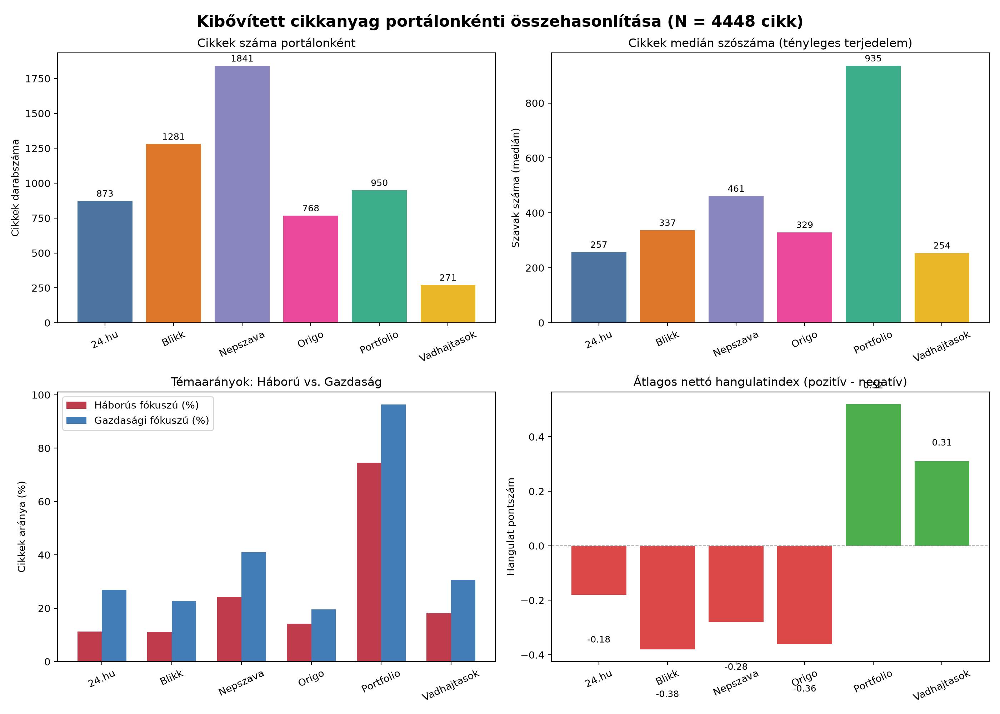
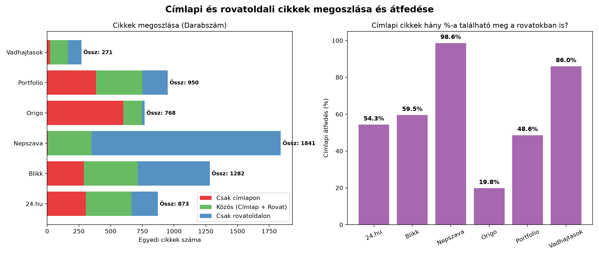
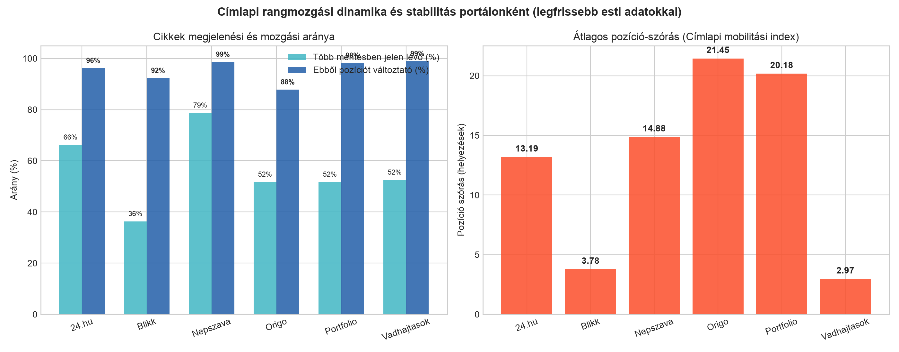

# Magyar hírportálok összehasonlító médiaelemzése
**Tartalmi struktúra, rovatátfedések és címlapi mobilitás (24.hu, Blikk, Népszava, Origo, Portfolio, Vadhajtások)**  
*Dátum: 2026. szeptember 10.*  
*Elemzési alap: 4 449 egyedi cikk, 9 081 pillanatkép-rekord (articles.db)*

---

## Vezetői összefoglaló

A három vizsgálati dimenzió ([analyze_corpus_expanded.py](analyze_corpus_expanded.py), [analyze_frontpage_rovat_overlap.py](analyze_frontpage_rovat_overlap.py) és [analyze_position_dynamics.py](analyze_position_dynamics.py)) alapján a hat hazai hírportál merőben eltérő szerkesztési stratégiát és tartalomelosztást követ:

1. **Tartalmi profil és terjedelem:** A Portfolio a maga átlagos 1 065 szavas terjedelmével és 97%-os gazdasági, 68,6%-os geopolitikai-háborús arányával a mélyelemző sajtót képviseli, míg a Vadhajtások (293 szó) és a 24.hu (320 szó) a gyors tájékoztatásra koncentrál.
2. **Címlap-architektúra:** A Népszava címlapja a rovatok szigorú, szűrt kirakata (a címlapi cikkek 96%-a a rovatokban is szerepel). Ezzel szemben az Origónál a címlapi híreknek mindössze 11,5%-a jelenik meg a rovatokban, vagyis a címlap önálló hírfolyamként működik.
3. **Címlapi dinamika és rotáció:** A Portfolio (17,7) és az Origo (16,6) működteti a legmozgékonyabb címlapot; itt a cikkek gyorsan több tucat helyet változtatnak fel vagy le. A Blikk és a Vadhajtások címlapja ezzel szemben jóval merevebb (2,8–3,3 helyezéses átlagos szórás).

---

## 1. Korpusz- és tartalomelemzés

A vizsgálat a cikkek Markdown törzsszövegét és metaadatait dolgozta fel. A terjedelem mérése mellett szótáralapú tematika- és hangulatelemzés készült.

| Portál | Cikkek száma | Átlagos szószám | Medián szószám | Pozitív cikkek (%) | Negatív cikkek (%) | Háborús fókusz (%) | Gazdasági fókusz (%) | Nettó hangulat |
| :--- | :--- | :--- | :--- | :--- | :--- | :--- | :--- | :--- |
| **24.hu** | 574 | 320,2 | 248,5 | 52,8% | 58,0% | 10,3% | 26,7% | -0,13 |
| **Blikk** | 863 | 436,4 | 342,0 | 56,3% | 69,2% | 11,7% | 25,7% | -0,39 |
| **Népszava** | 1 716 | 595,3 | 461,5 | 62,7% | 71,1% | 24,2% | 40,4% | -0,28 |
| **Origo** | 454 | 385,2 | 337,0 | 56,6% | 66,5% | 11,7% | 20,5% | -0,29 |
| **Portfolio** | 636 | 1 065,4 | 938,5 | 92,9% | 80,8% | 68,6% | 97,0% | +1,05 |
| **Vadhajtások** | 205 | 293,1 | 254,0 | 76,1% | 52,7% | 20,5% | 28,8% | +0,33 |

### Főbb megállapítások:
* **Hírnegativizmus:** A klasszikus hír- és bulvároldalak (Blikk, Origo, Népszava, 24.hu) mind negatív nettó hangulatindexet mutatnak, a cikkek 58–71%-a tartalmaz negatív/válság kifejezéseket (baleset, gyász, infláció, veszteség).
* **Portfólió-specifikus szókincs:** A Portfolio kiemelkedő pozitív pontszáma (+1,05) a gazdasági növekedési, tőzsdei és vállalati eredmény-kifejezések gyakori használatából fakad.
* **Gyakori kulcsszavak és nevek:** A politikai szereplők közül a címekben leggyakrabban előforduló nevek: *Péter* (Magyar Péter kapcsán Népszava, Origo, Vadhajtások), valamint *Orbán* (Népszava) és *Kormány* (Vadhajtások).

---

## 2. Címlapi és rovatoldali lefedettség és átfedés

A kutatás összevetette a főoldali címlapi pillanatképeket és a tematikus alrovatok (politika, gazdaság, kultúra, bulvár, sport) oldalait.

| Portál | Összes egyedi cikk | Címlapon megjelent | Rovatban megjelent | Közös cikkek | Csak címlapon | Csak rovatban | Címlap átfedése rovattal (%) | Jaccard hasonlóság (%) |
| :--- | :--- | :--- | :--- | :--- | :--- | :--- | :--- | :--- |
| **24.hu** | 574 | 397 | 346 | 169 | 228 | 177 | 42,6% | 29,4% |
| **Blikk** | 864 | 387 | 673 | 196 | 191 | 477 | 50,6% | 22,7% |
| **Népszava** | 1 716 | 227 | 1 707 | 218 | 9 | 1 489 | **96,0%** | 12,7% |
| **Origo** | 454 | 435 | 69 | 50 | 385 | 19 | **11,5%** | 11,0% |
| **Portfolio** | 636 | 460 | 326 | 150 | 310 | 176 | 32,6% | 23,6% |
| **Vadhajtások** | 205 | 119 | 182 | 96 | 23 | 86 | 80,7% | **46,8%** |

### Főbb modellek:
* **Hierarchikus napilap-modell (Népszava):** A címlap szinte kizárólag (96%) a rovatokból merít. A rovatok gazdag háttéranyagot jelentenek (1 489 cikk), melyből a címlapra a kiemelt 218 darab kerül.
* **Címlap-vezérelt bulvármodell (Origo):** A címlapi cikkek 88,5%-a egyáltalán nem szerepel a letöltött rovatoldalakon. A címlap önálló hírfolyam, míg a rovatok ritkábban frissülnek.
* **Kompakt, homogén szerkezet (Vadhajtások):** A legmagasabb Jaccard-hasonlóság (46,8%), ahol a rovatok és a címlap közötti cikkátjárás közvetlen és folyamatos.

---

## 3. Címlapi pozíció- és rangmozgási dinamika

A címlapi cikkek pozíciójának időbeli alakulása (1. hely = a címlap legteteje; a pozitív szám előrelépést, a negatív hátrasorolást jelez).

| Portál | Címlapi cikkek | Többször megjelent | Több mentés aránya (%) | Pozíciót váltók (%) | Jelentős emelkedés (≥5) | Jelentős esés (≥5) | Átlagos pozíció-szórás (mobilitás) | Átlagos pozíciósáv |
| :--- | :--- | :--- | :--- | :--- | :--- | :--- | :--- | :--- |
| **24.hu** | 397 | 259 | 65,2% | 90,3% | 6 db | 127 db | 10,50 | 22,7 |
| **Blikk** | 387 | 119 | 30,7% | 93,3% | 2 db | 21 db | 3,26 | 7,2 |
| **Népszava** | 227 | 168 | 74,0% | 97,6% | 5 db | 121 db | 9,65 | 20,1 |
| **Origo** | 435 | 216 | 49,7% | 83,3% | 10 db | 146 db | 16,56 | 35,4 |
| **Portfolio** | 460 | 202 | 43,9% | 95,5% | 12 db | 142 db | **17,67** | **37,9** |
| **Vadhajtások** | 119 | 72 | 60,5% | 95,8% | 0 db | 23 db | 2,80 | 6,1 |

### Kirívó pozícióváltozások

#### Top előrelépések (Rising articles)
* **24.hu (+86 hely):** *„Orosz dróntámadás az ukrán–moldáv határátkelőn...”* (115. pozícióból a 29.-re ugrott)
* **Origo (+82 hely):** *„Provokatív kérdésekkel bombázta a gyászoló apát Tisza-párti...”* (95. pozícióból a 13.-ra tört előre)
* **24.hu (+71 hely):** *„Trump gratulált az AfD választási sikeréhez”* (116. pozícióból a 45.-re)
* **Portfolio (+60 hely):** *„Brüsszel ráfordul Grönlandra: százmilliárdokat mozgatnak meg...”* (101. pozícióból a 41.-re)

#### Top visszaesések (Falling articles)
* **24.hu (-110 hely):** *„Szélesedik a háború: már amerikai hajókat is támadnak...”* (7. kiemelt helyről a 117.-re csúszott le)
* **24.hu (-108 hely):** *„Azt hitték, horgonyt találtak vízitúrázás közben a...”* (14. helyről a 127.-re esett)
* **Origo (-102 hely):** *„Szoboszlaitól rettegnek Madridban? Látni kell a Li...”* (2. helyről a 104.-re sorolódott vissza)
* **Origo (-102 hely):** *„Több mint 1800 év után derült ki, kit ábrázolhatott...”* (14. helyről a 116.-ra került)

---

## 4. Összegző tipológia

| Kategória | Portálok | Jellemzők |
| :--- | :--- | :--- |
| **Elemző / Mélyhír** | Portfolio | Kimagasló terjedelem (1000+ szó), gazdasági és háborús fókusz, rendkívül gyors címlapi rotáció. |
| **Szerkesztett napilap** | Népszava | Kiegyensúlyozott terjedelem, a rovatok teljes körű címlapi lefedettsége (96%), tartós jelenlét (74%). |
| **Címlap-központú bulvár** | Origo, Blikk | Magas negatív hangulat, alacsony rovatátfedés (Origo 11,5%), magas cikkcsere-sebesség (Blikknél 30% túlélés). |
| **Gyorshír / Tömör feed** | 24.hu, Vadhajtások | Rövid cikkek (250–320 szó), mérsékeltebb vagy merevebb címlapi átrendeződés. |
